## About VoiceFlow

VoiceFlow is a vocal training platform designed specifically for musicians and singers, enabling them to warm up their voices before performances. Whether you're a beginner or an advanced performer, VoiceFlow offers a range of customizable exercises tailored to suit every skill level. The platform allows users to choose between diverse personalized warm-up routines, helping them gradually improve their vocal technique.

In addition to the exercises, VoiceFlow provides an engaging way for users to monitor their progress over time, allowing them to visualize improvements and continue refining their vocal abilities in the broader context of _gamification_. Our goal is to create a comprehensive space where singers and musicians alike can prepare their voices for any performance, all while fostering growth and development.

One of the key aspects of the training game, the _pitch tracker_, was also furtherly developed, and a dedicated page for this useful tool was also added. We believed that the functionalities of this powerful tool were too good to be relegated to a side part of the project, so we decided to give it a dignity of its own.

This project was developed as the final project for the Advanced Coding Tools and Methodology course in the Music and Acoustic Engineering program at Politecnico di Milano by Michele Zanardi, Gianluigi Vecchini, Federico Capitani, and İpek Ceren Bayram.

## Technologies Used

### Web API, Tone.js and Salamander Grand Piano

One of the most important aspect of the training game is the designing of the piano keyboard: it is powered by modern Web Audio APIs, such as the [Tone.js](https://tonejs.github.io) JavaScript library throught the use of its <small>`Tone.Sampler()`</small>. The samples used are the ones from the well-known [Salamander Grand Piano set on GitHub](https://github.com/sfzinstruments/SalamanderGrandPiano), based on the popular Yamaha G5 Grand Piano and recorded in high quality.

### FireBase FireStore Integration

In order to include in the project a large database of diverse exercises and various personalized workouts, as well as all the aspects related to the _login_ functions for the users, a [FireBase FireStore](https://firebase.google.com/docs/firestore?hl=it) database was set up. FireStore is a NoSQL realtime database that uses Collections and Documents instead of tables and rows, perfect for scalability, real-time applications and large quantities of data. The structure of the database for this application is easy to mantain, as it can be seen in the next image.

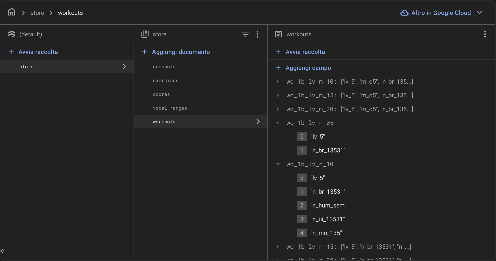

### Microphone Integration and Tuner Algorithm

Another important feature of the project is the website's ability to provide a real-time pitch detection. To achive this, the [Web Audio API](https://developer.mozilla.org/en-US/docs/Web/API/Web_Audio_API) is used to capture audio from the user's microphone. The microphone input is managed through <small>`navigator.mediaDevices.getUserMedia()`</small>, which, combined with the methods <small>`.createMediaStreamSource()`</small>, <small>`.createAnalyser()`</small>, <small>`.fftSize`</small> and <small>`getFloatTimeDomainData()`</small>, allows obtaining a buffer of floating-point numbers that represent the amplitude level of each frequency bin at a specific time frame.

Thanks to the <small>`autoCorrelate()`</small> function, the dominant frequency of the audio signal is then calculated by computing the autocorrelation of the buffer. Autocorrelation measures how well the signal matches itself when shifted in time. If the signal repeats itself periodically with period T, then shifting the signal by T (or multiples of T) will align similar parts of the signal, producing local maxima (peaks) at those lags.
The skeleton of this algorithm has been taken from the GitHub page [PitchDetect](https://github.com/cwilso/PitchDetect/blob/main/js/pitchdetect.js) and improved with:
- The <small>`applyHannWindow()`</small> function, which smooths out the audio signal.
- The normalization of the buffer, that ensures consistency in analysis.

The tuner's ability to detect frequencies mainly depends on the following variables:
- <small>`tuneTolerance`</small>: The threshold in cents between two frequencies to be considered in tune. It is set to 30.
- <small>`fftSize`</small>: The number of samples taken per frame. It is always set to 2048, except during the game, where it is reduced to 1024 to provide a quicker time response in despite of the frequency resolution.

For a better understanding of the algorithm it is suggested to take a look at the tuner/tuner.js script, which is commented in detail.

Once the dominant frequency is identified, the detune value is calculated in cents (where a half-tone is 100 cents).

## User experience

Let's have a quick look to the main functionalities of VoiceFlow.

The main page let us choose between the Vocal Trainer and the Pitch Tracker.

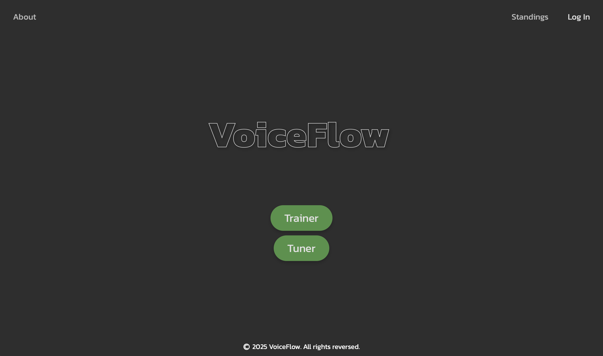

The second choice will lead us to the "Pitch Tracker" page, where we can tune our instruments or find the pitch of a note using a simple yet powerful interface.

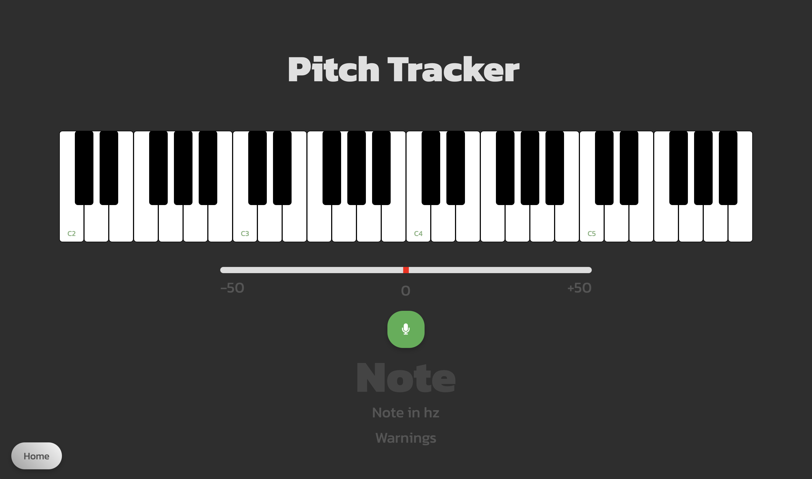

We can also select the "Login" button, and we will be redirected to the login interface. Here we can create our account or log in with our credentials.

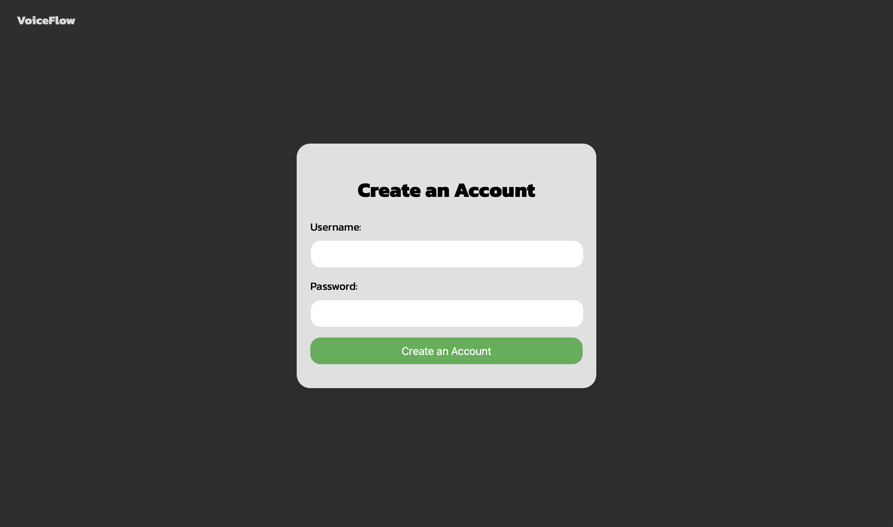
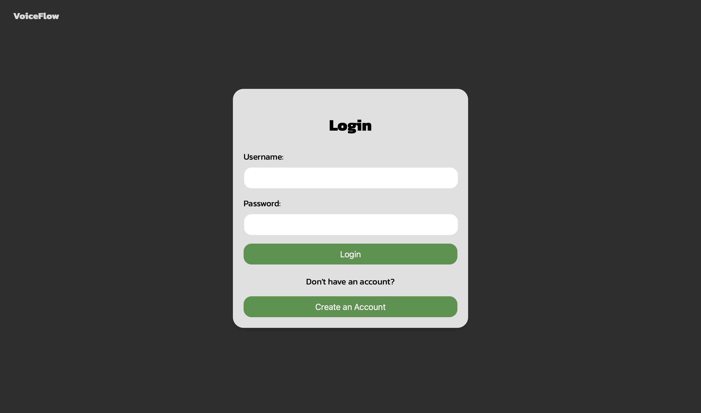

Let's go back to the initial page and choose "Trainer". We will be redirected to the first of a series of "fine tunings" for our vocal workout. In this case, we have to choose our skill level between "Beginner", "Intermediate" and "Advanced".

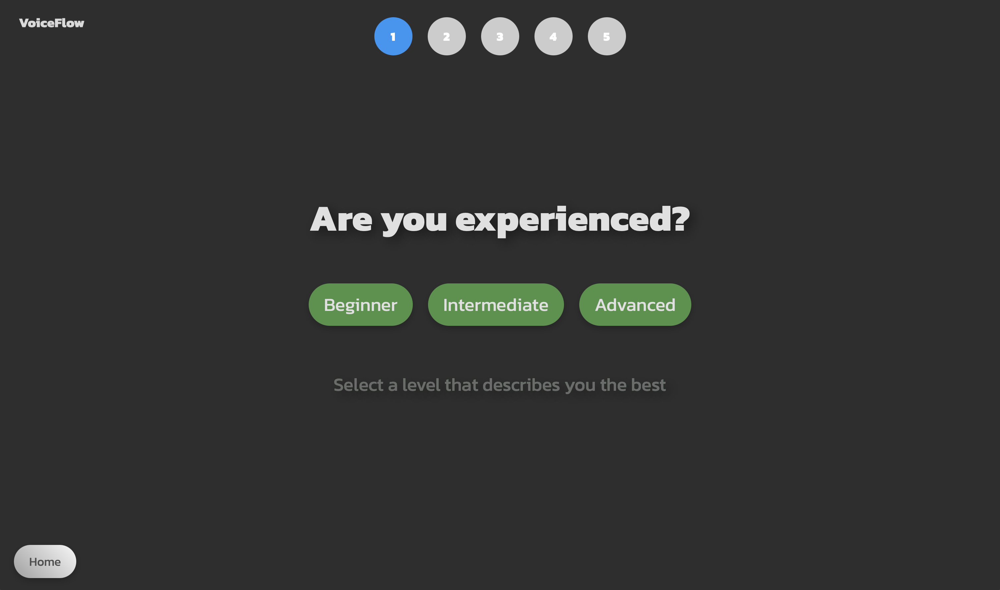

We will then have to choose how much time we have for the training, using the big slider in the center of the page.

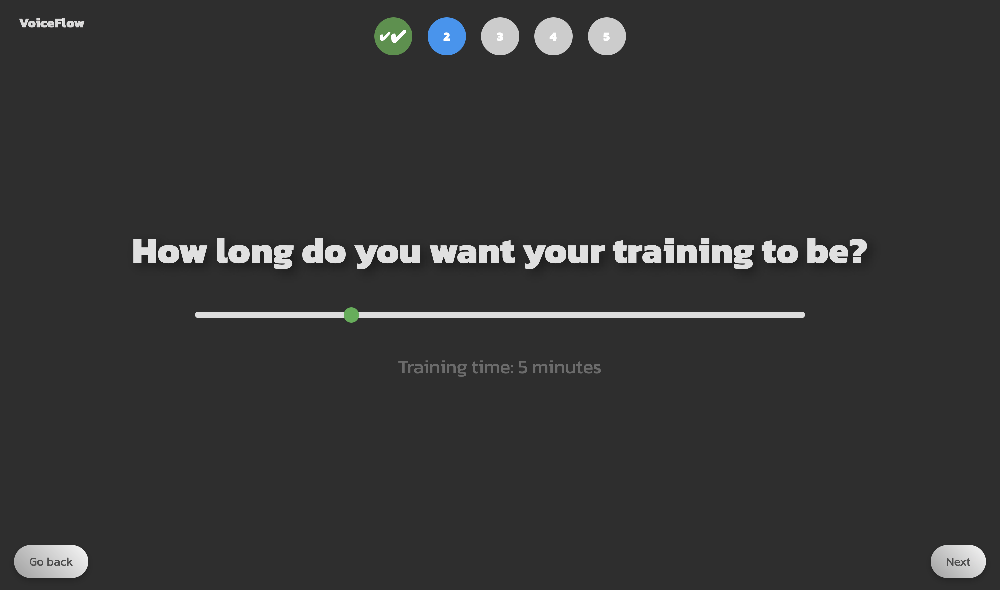

The next selection is the most refined: we can choose our voice type using three different methods. The first one allow us to decide between the six main vocal ranges (soprano, mezzosoprano, alto, tenor, baritone and bass). The second one is thought for "pro" users: if you know your specific range, you can input it via a virtual keyboard. The last feature is designed for less experienced users who want to determine their vocal range. The user can select their range by finding the lowest and highest notes they can sing using the website’s tuner.

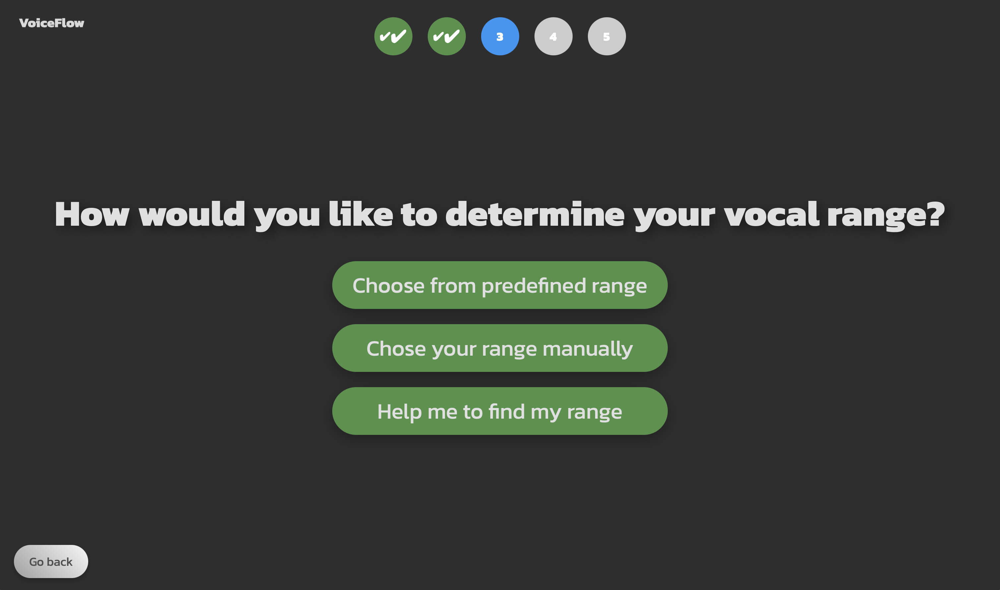
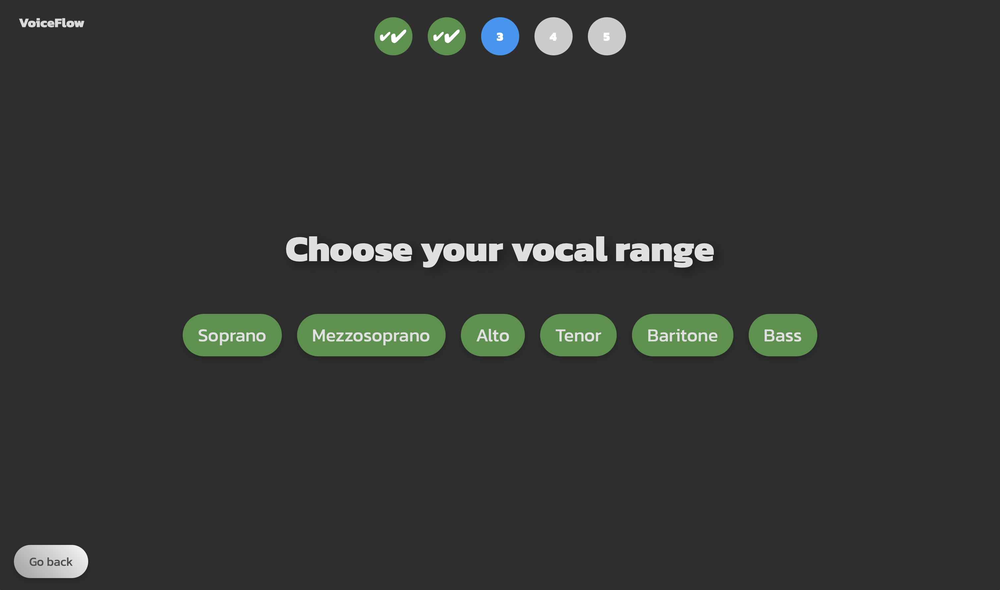
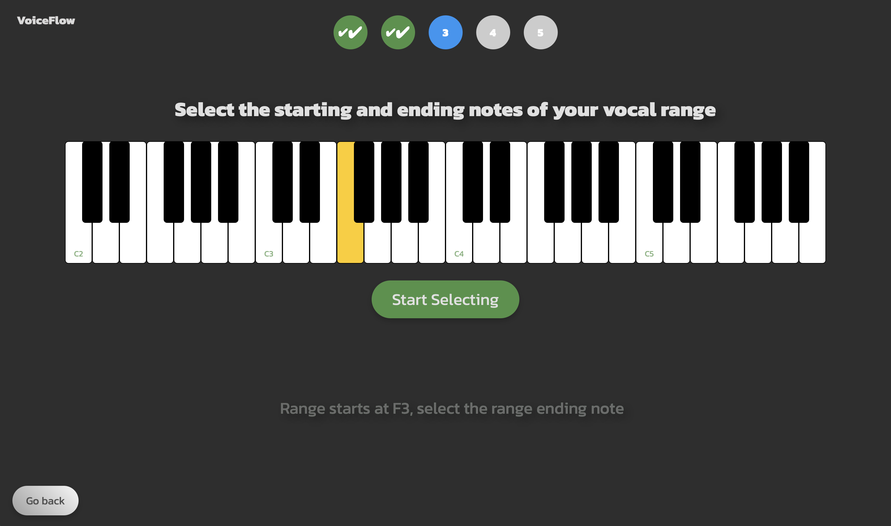
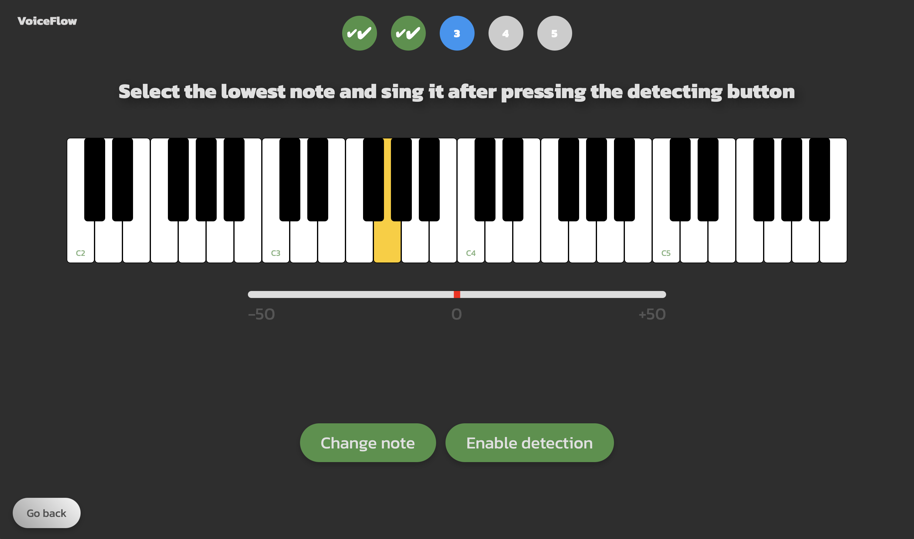

As many experienced singers know, there are a lot of tools that can help warm up your voice before a performance or just to exercise. We selected two popular SOVTE (Semi-Occluded Vocal Tract Exercises) tools, the Mask and the Lax Vox. If you have them, your workout will change accordingly!

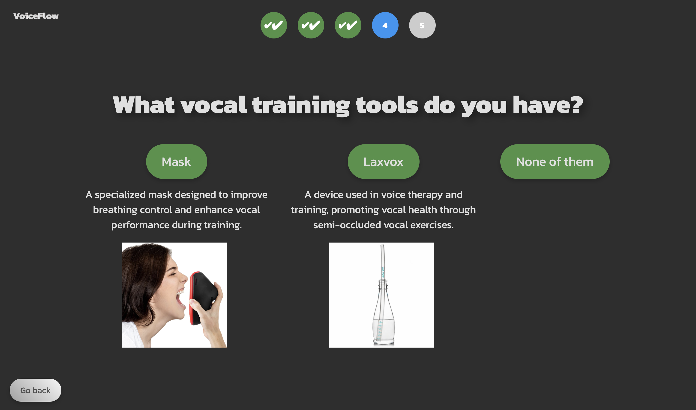

A quick recap page will lead us to the real workout page.

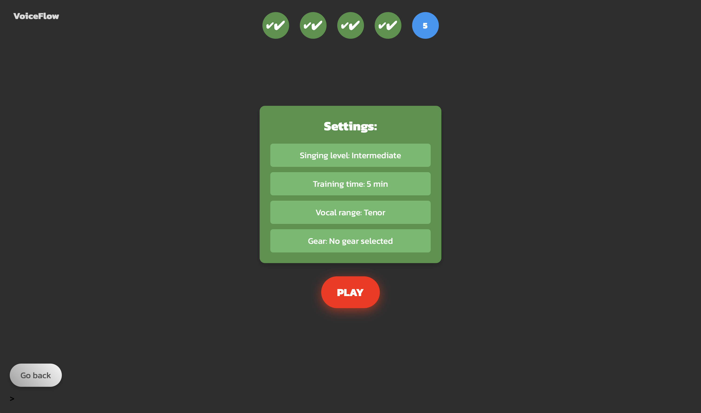

The Training Game Page is the heart of VoiceFlow. Here we can sing along the exercises and see in real time the points that we are getting during the game. When we are ready, we can press on the "Play" to start. 

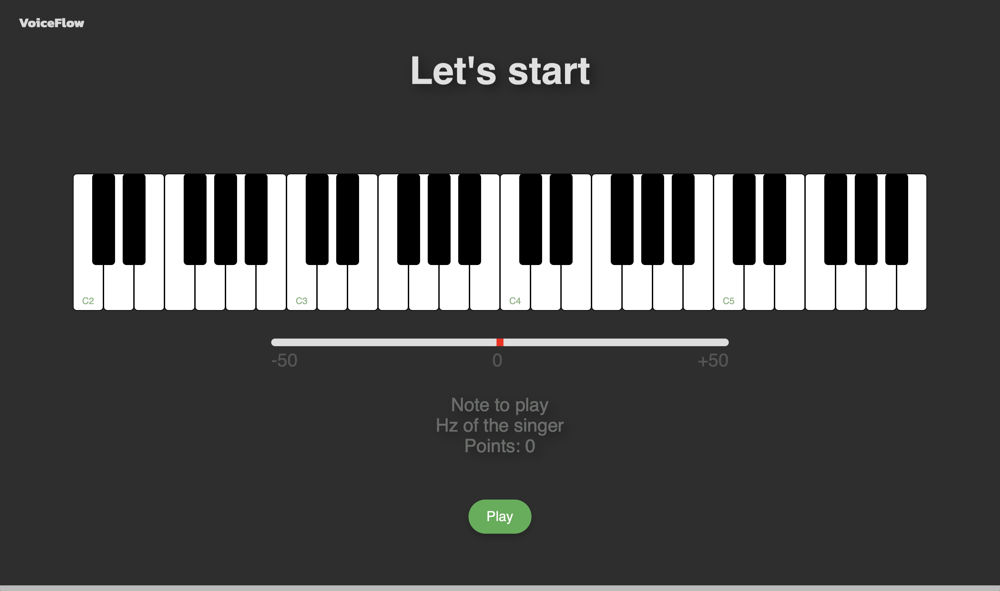
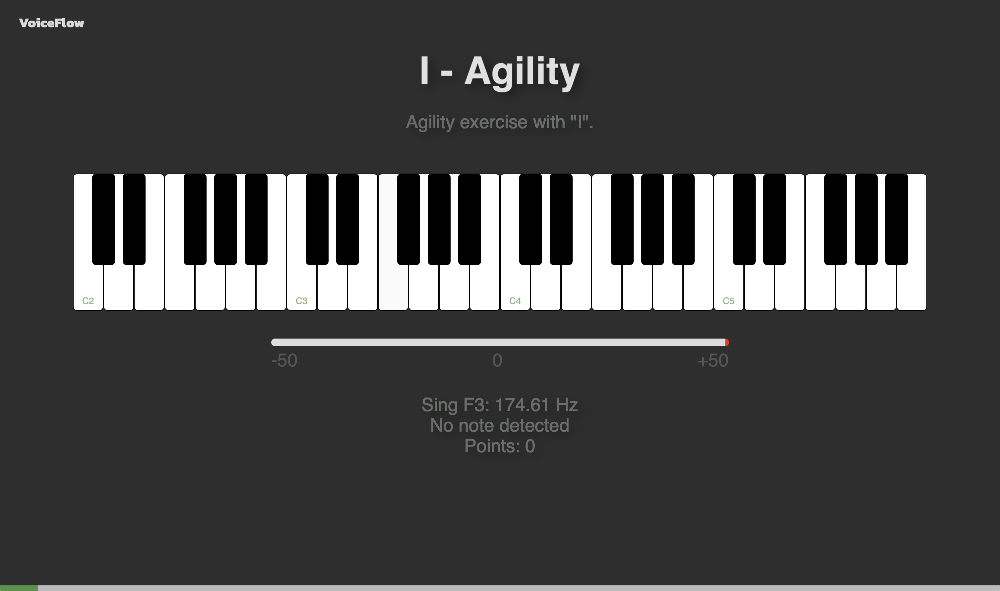

As we finish our training, the results will appear automatically. If you are logged in and have managed to beat your best score for the current level, the application will let you know. And if you were good enough to enter the Top 10, your name and your score will be remembered along the ones of the champions!

There is also a dedicated page for the Standings in the home page. All the best scores for Beginner, Intermediate and Advanced level are displayed here.

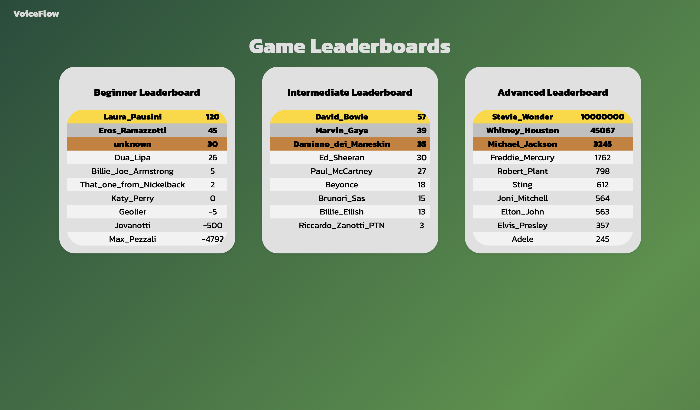
